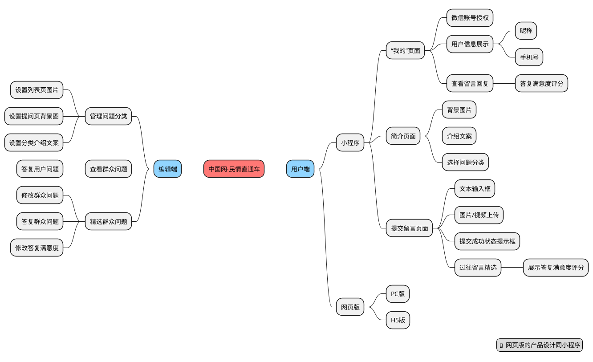

# 中国网·民情直通车产品规划

## 产品框架

## 安全保障

作为一个连接群众和政府的政务类项目，其重中之重是保障产品的安全性，不仅要在产品和技术层面上满足监管部门的要求，同时也要在运营层面上满足严格的媒体管理要求。

### 技术层面

在技术层面上，将严格按照[《国家电子政务标准体系建设指南》](https://gkml.samr.gov.cn/nsjg/bzjss/202006/W020200619303475665607.pdf)的要求执行，同时满足中国网内部 IT 系统的各项要求，确保系统的安全性和强健性。

### 运营层面

在运营层面上，核心是在各个环节都设置审核功能，所有在前台内容都仅在审核通过的前提下才能展示，并且可以实时进行编辑和删除。

## 重点功能

整个产品的功能设计立足于强展示、强交互、强扩展的原则。

首先，在整个产品的 UI 层面上，重点突出习总书记新年讲话的重要思想，给群众极强的视觉冲击力。同时，在各个页面里预留自定义模块，为未来的宣传和推广商业化做准备

其次，通过各种精心设计的交互机制，让群众提问之后可以通过各种通知机制，及时获取到答复情况，还可以进行答复满意度打分，解决同类竞品普遍存在的缺乏后续跟进机制的问题。

最后，在产品层面上可以通过模版机制进行快速复制，将产品能力输出给各个单位和政府机构，帮助他们按照各自的定制化需求定制自己的留言板产品。

### 用户端

+ 以微信小程序为主要载体，同时以 H5 页面为基础覆盖浏览器、头条、APP 等全平台
+ 通过微信授权 + 手机号验证的方式，对群众留言的真实性进行验证
+ 用户在“我的”模块中，可查看自己提出问题的实时答复情况，并进行满意度评分，强化互动性
+ 通过增加提问所属领域分类机制，更好的明确问题的指向性，明确责任主体
+ 所有的分类问题提交详情页面，均可以单独设置背景图片和说明文字，充分满足宣传和推广需求
+ 群众提交问题时除了提交文字描述之外，还可以上传图片和视频，更好的展现问题的全貌

### 编辑端

+ 所有来源的数据打通，均纳入同一个平台中进行管理，减少管理成本
+ 通过设置主管理员-管理员机制，开放管理后台，便于相关部门和单位自主答复问题
+ 在后台回复了群众提交的问题之后，可以通过公众号对群众发出通知，或者短信进行提醒
+ 可以对群众提交的问题进行审核，只有符合标准的才能在前台展示
+ 可以对相关部门提交的答复进行审核，只有符合标准的才能在前台展示
+ 可以对群众提交的问题的文案进行编辑，以便更加符合精选留言的展示需求

## 运营建议

+ 产品收费：以产品平台的形式，为其他公司和单位提供定制化功能服务，满足其内部的收集信息和互动的需求
+ 宣传收费：在列表页和提问详情页里面提供广告位，通过宣传推广进行收费，比如在房地产相关分类中，可以给房地产公司提供宣传推广位
+ 效果收费：在列表页中，增加直接的 App 下载或者小程序唤醒的广告位，比如民生类问题中，可以对朴朴、美团买菜等进行推广

## 竞品参考

### 人民网·领导留言板

* [人民网·领导留言板](http://liuyan.people.com.cn/)

### 新华网·我为群众办实事

* [新华网·我为群众办实事](https://hudong.app.xinhuanet.com/wqzbss/index.html)

### 长江云问吧

