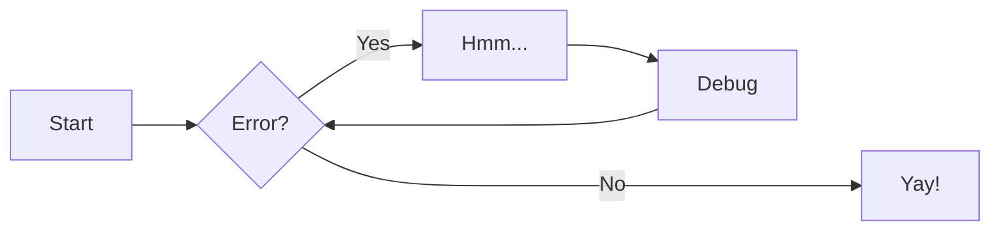
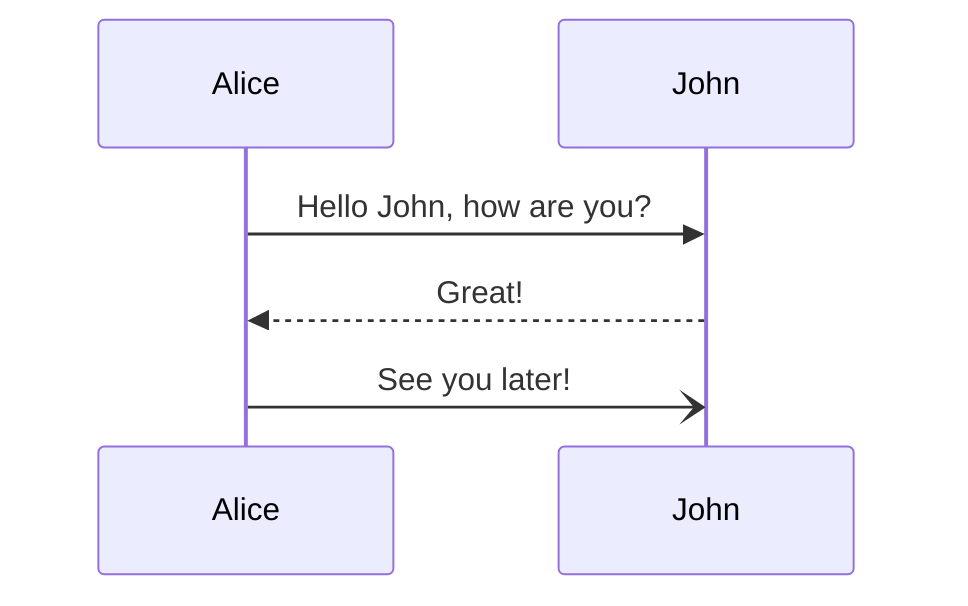
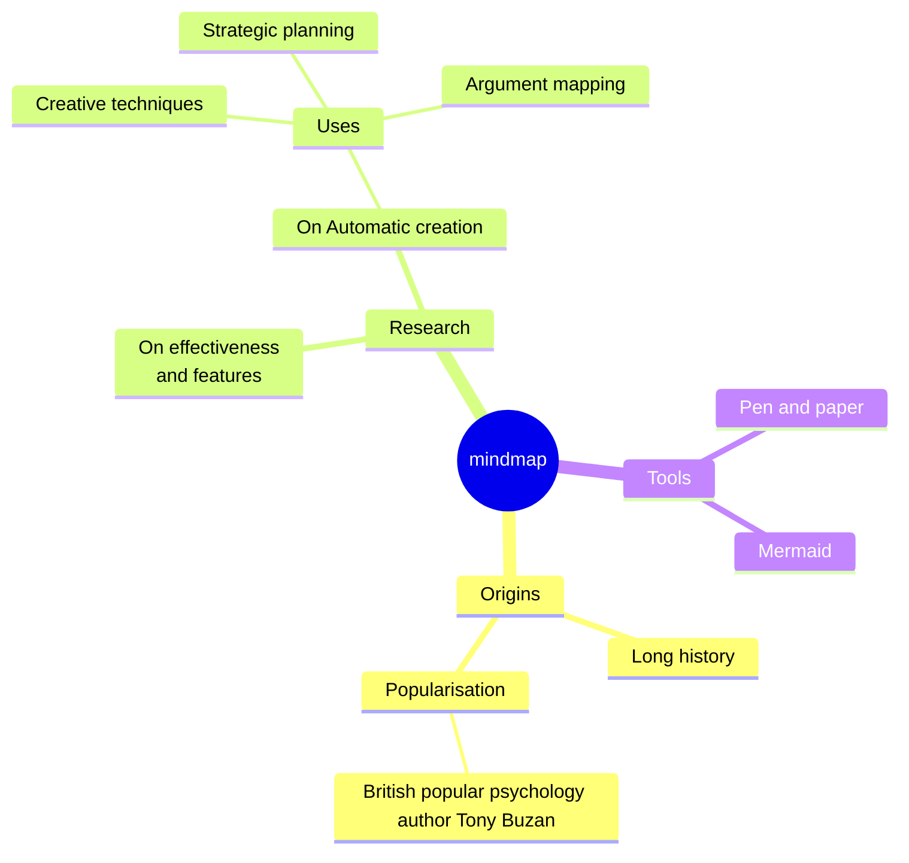
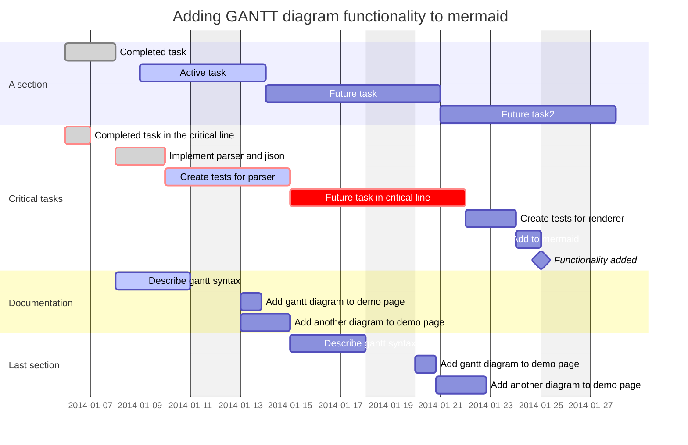
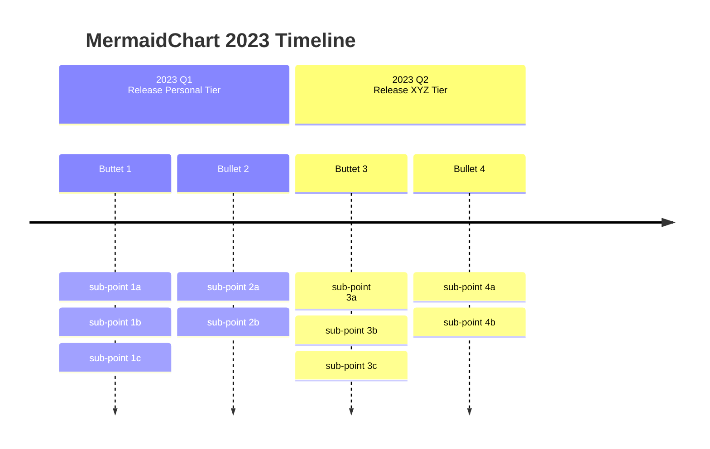

# MkDocs 加强语法

要想写出美观漂亮的文档，仅仅掌握基本的 Markdown 语法是远远不够的。以下介绍的加强语法，都是 Material for MkDocs 中的专属特性，其中还有一些需要通过另外的第三方插件实现。

因此，本文展现的效果，仅限于在我个人专属的 Material for MkDocs insider 版本中使用，其他版本的 MkDocs 的支持程度各不相同。 

## emoji & Icons

提升文章的趣味性，可以在 Markdown 文本中插入 [emoji & Icons](https://squidfunk.github.io/mkdocs-material/reference/icons-emojis/) 。目前主要支持 emoji、Material Design 和 Fontawesome 三种类型，还可以使用 CSS 样式来增加颜色和动效。

* :smile:{ .anim }
* :material-rocket-launch-outline:
* :fontawesome-regular-face-laugh-wink:

## Keyboard

写教程是不可避免要使用快捷键的，[Keys](https://facelessuser.github.io/pymdown-extensions/extensions/keys/) 可以在 Markdown 文本中插入键盘按键样式，这对于提升教程文档的可读性非常有帮助。

- ++ctrl+alt+"My Special Key"++
- ++cmd+alt+"&Uuml;"++

## Admonitions

对于需要特别强调的大块内容，可以通过 [Admonitions](https://squidfunk.github.io/mkdocs-material/reference/admonitions/) 在插入一些醒目的提示框。

!!! note "看不懂的法语~~~"

    Lorem ipsum dolor sit amet, consectetur adipiscing elit. Nulla et euismod
    nulla. Curabitur feugiat, tortor non consequat finibus, justo purus auctor
    massa, nec semper lorem quam in massa.

## Anotations

[Annotations](https://squidfunk.github.io/mkdocs-material/reference/annotations/) 的主要使用场景主要是在代码块中插入注释，可以进一步提升代码的展示效果。

```yaml title="代码注释"
theme:
  features:
    - content.code.annotate # (1)
```

1.  :man_raising_hand: I'm a code annotation! I can contain `code`, __formatted
    text__, images, ... basically anything that can be written in Markdown.

## Critic

[Critic Markup](https://github.com/CriticMarkup/CriticMarkup-toolkit) 语法是一种用来对文档进行标注的语法，它可以标注出文档中的新增、删除、高亮、注释等内容，用于文档的审阅和修改。

Text can be {--deleted--} and replacement text {++added++}. This can also be
combined into {~~one~>a single~~} operation. {==Highlighting==} is also
possible {>>and comments can be added inline<<}.

{==

Formatting can also be applied to blocks by putting the opening and closing
tags on separate lines and adding new lines between the tags and the content.

==}

## Definition Lists 

[Definition lists](https://squidfunk.github.io/mkdocs-material/reference/lists/) 可以在文本中插入词汇定义列表，相对于脚注和缩写会更加直接明了。

`Lorem ipsum dolor sit amet`

:   Sed sagittis eleifend rutrum. Donec vitae suscipit est. Nullam tempus
    tellus non sem sollicitudin, quis rutrum leo facilisis.

`Cras arcu libero`

:   Aliquam metus eros, pretium sed nulla venenatis, faucibus auctor ex. Proin
    ut eros sed sapien ullamcorper consequat. Nunc ligula ante.

    Duis mollis est eget nibh volutpat, fermentum aliquet dui mollis.
    Nam vulputate tincidunt fringilla.
    Nullam dignissim ultrices urna non auctor.

## Grids

[Grids](https://squidfunk.github.io/mkdocs-material/reference/grids/) 可以在 Markdown 文本中插入网格布局，用于展示多个内容块。

<div class="grid cards" markdown>

-   :material-clock-fast:{ .lg .middle } __Set up in 5 minutes__

    ---

    Install [`mkdocs-material`](#) with [`pip`](#) and get up
    and running in minutes

    [:octicons-arrow-right-24: Getting started](#)

-   :fontawesome-brands-markdown:{ .lg .middle } __It's just Markdown__

    ---

    Focus on your content and generate a responsive and searchable static site

    [:octicons-arrow-right-24: Reference](#)

-   :material-format-font:{ .lg .middle } __Made to measure__

    ---

    Change the colors, fonts, language, icons, logo and more with a few lines

    [:octicons-arrow-right-24: Customization](#)

-   :material-scale-balance:{ .lg .middle } __Open Source, MIT__

    ---

    Material for MkDocs is licensed under MIT and available on [GitHub]

    [:octicons-arrow-right-24: License](#)

</div>

如果有图片导航的需求，则可以使用 [Neoteroi Cards](https://www.neoteroi.dev/mkdocs-plugins/cards/)，样式会更加美观。

::cards::

- title: Zeus
  content: Lorem ipsum dolor sit amet.
  image: ../../media/img/20231112144508.png

- title: Athena
  content: Lorem ipsum dolor sit amet.
  image: ../../media/img/20231112144603.png

- title: Poseidon
  content: Lorem ipsum dolor sit amet.
  image: ../../media/img/20231112144745.png

- title: Artemis
  content: Lorem ipsum dolor sit amet.
  image: ../../media/img/20231112144801.png

- title: Ares
  content: Lorem ipsum dolor sit amet.
  image: ../../media/img/20231112144814.png

- title: Nike
  content: Lorem ipsum dolor sit amet.
  image: ../../media/img/20231112144830.png

::/cards::

## Buttons

[Buttons](https://squidfunk.github.io/mkdocs-material/reference/buttons/) 可以在文本中插入按钮，用于直观的引导用户进行下一步操作。

[Send :fontawesome-solid-paper-plane:](#){ .md-button }

## Badges

[Badges](https://mkdocs-badges.six-two.dev/) 可以在文本中插入各种样式的勋章，用于展示例如版本号、包依赖等信息。

|Link badge equivalent|example.com|link:https://www.example.com|

## Code blocks

[Code blocks](https://squidfunk.github.io/mkdocs-material/reference/code-blocks/) 在基本语法的基础上增加了大量的特性，可以支持标题、行号、高亮、复制、注释等多种功能。

```python title="Python" hl_lines="2 3"
def bubble_sort(items):
    for i in range(len(items)):
        for j in range(len(items) - 1 - i): #(1)
            if items[j] > items[j + 1]:
                items[j], items[j + 1] = items[j + 1], items[j]
```

1.  第二层循环和条件判断

## Content tabs

[Content tabs](https://squidfunk.github.io/mkdocs-material/reference/content-tabs/) 可以在文本中插入用标签切换的内容块，用于在同一个块中平行展示多个内容。

=== "Unordered list"

    * Sed sagittis eleifend rutrum
    * Donec vitae suscipit est
    * Nulla tempor lobortis orci

=== "Ordered list"

    1. Sed sagittis eleifend rutrum
    2. Donec vitae suscipit est
    3. Nulla tempor lobortis orci

## Tables

[Tables](https://squidfunk.github.io/mkdocs-material/reference/data-tables/) 可以在文本中插入数据表格，用于展示数据。通过添加自定义的 CSS 样式和 JS 脚本，可以实现排序、对齐等多种增强功能。

|  Method  |             Description              |
| :------: | :----------------------------------: |
|  `GET`   | :material-check:     Fetch resource  |
|  `PUT`   | :material-check-all: Update resource |
| `DELETE` | :material-close:     Delete resource |

Markdown 的表格默认不支持合并单元格，事实上合并之后也会影响增删改查以及排序等操作。但在特定的场景下，对于那些不经常修改的表格，我们也会有合并单元格美化展示效果的需求。
 
通过 [Neoteroi - Spantable](https://www.neoteroi.dev/mkdocs-plugins/spantable/) 的扩展支持，我们可以实现如下的效果。

::spantable:: caption="合并表格示例"

| Italy @span   |       | 40 @span      |       | 20 @span      |       |
| ------------- | ----- | ------------- | ----- | ------------- | ----- |
|               |       | Men           | Women | Men           | Women |
|               |       | 78            | 82    | 77            | 81    |
| Poland @span  |       | 40 @span      |       | 20 @span      |       |
| ------------- | ----- | ------------- | ----- | ------------- | ----- |
|               |       | Men           | Women | Men           | Women |
|               |       | 78            | 82    | 77            | 81    |

::end-spantable::

## Image

由于 HTML 中的图片语法不支持居中对齐，为了实现这个效果，我们需要使用 [img2figv2](https://github.com/Jackiexiao/mkdocs-img2figv2-plugin) 来将其自动嵌套在一个 `<figure>` 标签中实现默认对齐效果。不过，如果设定了 `width` 参数，那么就只能设定左对齐或者右对齐了。。

{align="right" width="50%"}

## Flowchart

[Mermaid](https://squidfunk.github.io/mkdocs-material/reference/diagrams/) 可以在文本中插入 Mermaid 语法支持的图表，用于展示[流程图](http://mermaid.js.org/syntax/flowchart.html)、[序列图](http://mermaid.js.org/syntax/sequenceDiagram.html)、[类图](http://mermaid.js.org/syntax/classDiagram.html)、[用户旅程](http://mermaid.js.org/syntax/userJourney.html)、[Git图表](http://mermaid.js.org/syntax/gitgraph.html)等多种和技术开发相关的图表。



目前 >10+ 版本的 Mermaid 样式是通过 [MkDocs-Mermaid2](https://mkdocs-mermaid2.readthedocs.io/en/latest/) 插件实现的。据 MkDocs for Material 的开发者透露，[下一个版本](https://github.com/squidfunk/mkdocs-material/issues/5758)的 Material for MkDocs 将会内置 Mermaid2 插件，届时就不需要单独安装插件了。



## Mindmap

[Markmap](https://github.com/markmap/mkdocs-markmap) 是一个简洁的思维导图插件，可以在文本中插入思维导图。

```markmap
# Root

## Branch 1

* Branchlet 1a
* Branchlet 1b

## Branch 2

* Branchlet 2a
* Branchlet 2b
```

类似的思维导图，在 [Mermaid Mindmap](https://mermaid.js.org/syntax/mindmap.html) 中也可以实现，但是 Mermaid 的思维导图语法略显复杂，不如 Markmap 的思维导图语法直观。



## Gantt

Mermaid 还支持 [Gantt 图表](http://mermaid.js.org/syntax/gantt.html)，可以直观的展现项目的进展。



Neoteroi 也有 [Gantt 图表](https://www.neoteroi.dev/mkdocs-plugins/gantt/)的样式，两者各有特定，可以根据需要选择。

::gantt::
- title: Definition Phase
  activities:
  - title: Creative Brief
    start: 2022-03-03
    lasts: 1 day
  - title: Graphic Design Research
    start: 2022-03-02
    end: 2022-03-10
    lasts: 2 weeks
  - title: Brainstorming / Mood Boarding
    start: 2022-03-11
    end: 2022-03-20

- title: Creation Phase
  activities:
  - title: Sketching
    start: 2022-03-21
    end: 2022-04-01
  - title: Design Building
    start: 2022-04-02
    end: 2022-04-20
  - title: Refining
    start: 2022-04-21
    end: 2022-04-30

- title: Feedback Phase
  activities:
  - title: Presenting
    start: 2022-04-22
    end: 2022-05-01
  - title: Revisions
    start: 2022-05-02
    end: 2022-05-10

- title: Delivery Phase
  activities:
  - title: Final delivery
    start: 2022-05-11
    end: 2022-05-12
::/gantt::

## Timeline

Timeline 也是一种非常漂亮的图表，[Mermaid Timeline](http://mermaid.js.org/syntax/timeline.html) 的样式很简洁。



同样的，Neoteroi 也有 [Timeline 图表](https://www.neoteroi.dev/mkdocs-plugins/timeline/)。两者一个纵向显示，一个横向显示，配合起来可以满足多种类型的需求。

::timeline::

- content: First implementation.
  icon: ':material-rocket-launch-outline:'
  sub_title: 2022-Q1
  title: Launch
- content: Lorem ipsum dolor sit amet, consectetur adipiscing elit.
  icon: ':fontawesome-solid-gem:'
  sub_title: 2022-Q2
  title: New features
- content: Lorem ipsum dolor sit amet.
  icon: ':material-gauge-empty:'
  sub_title: 2022-Q3
  title: More features!
- content: Lorem ipsum dolor sit amet.
  icon: ':material-bug:'
  sub_title: 2022-Q4
  title: Bugs!

::/timeline::

## ProgressBar

[ProgressBar](https://facelessuser.github.io/pymdown-extensions/extensions/progressbar/) 可以在 Markdown 文本中插入进度条，用于展示工作进度。

[=10%]{: .thin}
[=50%]

[=85% "85%"]{: .candystripe}
[=100% "100%"]{: .candystripe .candystripe-animate}

## Video

使用 `<video>` 标签可以在文本中插入本地视频，但是由于视频的体积较大会严重消耗流量，因此一般不会直接插入本地视频，而是通过插入第三方视频网站的链接来实现同样的效果。

```html title="本地视频嵌入代码"
<video src="../../media/video/test.mp4" controls title="Title"></video>
```

对于中文视频，我们一般都会放到 Bilibili 上。为了提升嵌入视频的体验，我们需要按照 [关于博客园内嵌入bilibili视频的优化](https://www.cnblogs.com/wkfvawl/p/12268980.html) 中的教程对官方提供的代码进行一些优化。

<!-- Video: 嵌入 Bilibili视频-->

<div style="position: relative; padding: 30% 45%;">
  <iframe style="position: absolute; width: 100%; height: 100%; left: 0; top: 0;" src="https://player.bilibili.com/player.html?cid=1325568478&aid=920673650&page=1&as_wide=1&high_quality=1&danmaku=0" frameborder="no" scrolling="no" allowfullscreen="allowfullscreen" sandbox="allow-top-navigation allow-same-origin allow-forms allow-scripts"></iframe>
</div>

<!-- TODO: 增加 Placeholder 语法说明-->
